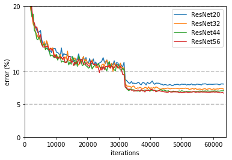

==================
Benchmarking Tasks
==================

There are two divisions of benchmarking, the closed one which is restrictive to allow fair comparisons of specific training algorithms and systems,
and the open divisions, which allows users to run their own models and code while still providing a reasonably fair comparison.

Closed Division
~~~~~~~~~~~~~~~

The Closed Division encompasses several subcategories to compare different dimensions of distributed machine learning. We provide precise reference implementations of each algorithm, including the communication patterns, such that they can be implemented strictly comparable between different hardware and software frameworks.

The two basic metrics for comparison are `Accuracy after Time` and `Time to Accuracy` (where accuracy will be test and/or training accuracy)

Variable dimensions in this category include:

- Algorithm
  - limited number of prescribed standard algorithms, according to strict reference implementations provided
- Hardware
  - GPU
  - CPU(s)
  - Memory
- Scalability
  - Number of workers
- Network
  - Impact of bandwidth and latency

Accuracy after Time
###################

The system has a certain amount ot time for training (2 hours) and at the end, the accuracy of the final model is evaluated.
The higher the better

Time to Accuracy
################
A certain accuracy, e.g. 97% is defined for a task and the training time of the system until that accuracy is reached is measured.
The shorter the better.

.. _Deep Residual Learning for Image Recognition:
    https://www.cv-foundation.org/openaccess/content_cvpr_2016/papers/He_Deep_Residual_Learning_CVPR_2016_paper.pdf

.. _CIFAR-10:
    http://www.cs.toronto.edu/~kriz/cifar.html

Here is a plot of validation error training iterations for ResNet on `CIFAR-10`_ using the settings from `Deep Residual Learning for Image Recognition`_.

Open Division
~~~~~~~~~~~~~
The Open Division allows you to implement your own algorithms and training tricks and compare them to other implementations. There's little limit to what can be changed by you and as such, it is up to you to make sure that comparisons are fair.

In this division, mlbench merely provides a platform to easily perform and measure distributed machine learning experiments in a standardized way.

Benchmark Task Descriptions
---------------------------
We here provide precise descriptions of the official benchmark tasks. The task are selected to be representative of relevant machine learning workloads in both industry and in the academic community. The main goal here is a fair, reproducible and
precise comparison of most state-of-the-art algorithms, frameworks, and hardware.

For each task, we provide a reference implementation, as well as benchmark metrics and results for different systems.

1a. Image Classification (ResNet, CIFAR-10)
~~~~~~~~~~~~~~~~~~~~~~~~~~~~~~~~~~~~~~~~~~~
Image classification is one of the most important problems in computer vision and a classic example of supervised machine learning.

#. **Model**
    We benchmark two model architectures of Deep Residual Networks (ResNets)
    based on prior work by He et al.
    The first model (m1) is based on the ResNets defined in
    `this paper <https://arxiv.org/abs/1512.03385>`_.
    The second version (m2) is based on the ResNets defined `here
    <https://arxiv.org/abs/1603.05027>`_.
    For each version we have the network implementations
    with 20, 32, 44, and 56 layers.
    TODO: only benchmark two most common architectures say (can support more, but they are not part of the official benchmark task)

#. **Dataset**
    The `CIFAR-10 <https://www.cs.toronto.edu/~kriz/cifar.html>`_
    dataset containing a set of images used to train machine learning
    and computer vision models.
    It contains 60,000 32x32 color images in 10 different classes,
    with 6000 images per class. The 10 different classes represent
    airplanes, cars, birds, cats, deer, dogs, frogs, horses, ships, and trucks.
    
    The train / test split as provided in the dataset is used.
    TODO: give precise details on distribution of data (or all access all in this case)

#. **Training Algorithm**
    We use standard synchronous SGD as the optimizer (that is distributed mini-batch SGD with synchronous all-reduce communication after each mini-batch).
    The learning rate scheduler decreases the learning rate over time, after initial increase (warmup).
    TODO: details

Implementation details:
* Data preprocessing
We followed the same approach as mentioned `here <https://arxiv.org/abs/1512.03385>`_.

* Selection of Framework & Systems
While our initial reference implementation is currently PyTorch, we will aim to provide the same algorithm in more frameworks very soon, starting with Tensorflow. For the systems, kubernetes allows easy transferability of our code. While initial results reported are from google kubernetes engine, AWS will be supported very soon.

* Results
Results come here!

1b. Image Classification (ResNet, ImageNet)
~~~~~~~~~~~~~~~~~~~~~~~~~~~~~~~~~~~~~~~~~~~
TODO
(again synchr SGD as main baseline)

2. Linear Learning (Generalized Linear Models for Regression and Classification)
~~~~~~~~~~~~~~~~~~~~~~~~~~~~~~~~~~~~~~~~~~~~~~~~~~~~~~~~~~~~~~~~~~~~~~~~~~~~~~~~
TODO
(more data intensive compared to deep learning. again synchr SGD as main baseline)

