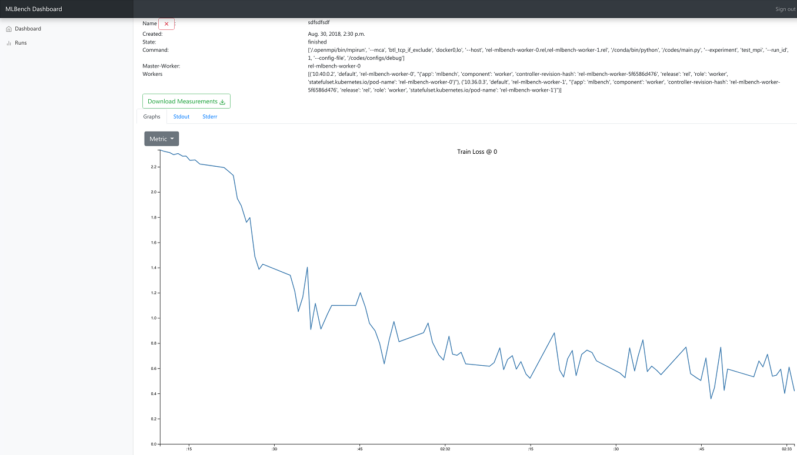

Dashboard
^^^^^^^^^

MLBench comes with a dashboard to manage and monitor the cluster and jobs.

Main Page
"""""""""

.. figure:: images/Dashboard_Index.png
   :alt: Dashboard Main Page

   Dashboard Main Page

The main view shows all MLBench worker nodes and their current status

Runs Page
"""""""""

.. figure:: images/Dashboard_Test.png
   :alt: Dashboard Runs Page

   Dashboard Runs Page

The Runs page allows you to start a new experiment on the worker nodes. You can select how many workers to use, how many CPU Cores each worker can utilize and limit the network bandwidth available to workers.

Run Details Page
""""""""""""""""

   Dashboard Run Details Page

The Run Details page shows the progress and result of an experiment. You can track metrics like ``train loss`` and ``validation accuracy`` as well as see the ``stdout`` and ``stderr`` logs of all workers.

It also allows you to download all the metrics of a run as well as resource usage of all workers participating in the run as json files.

