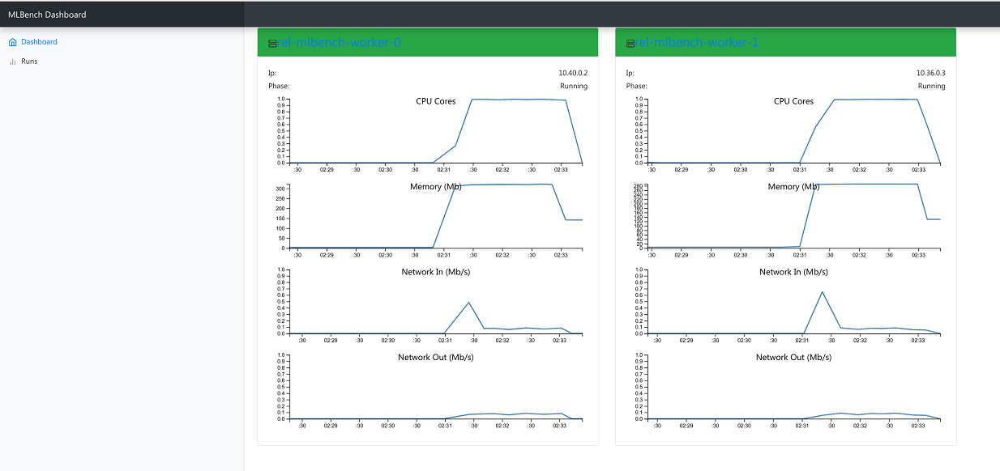
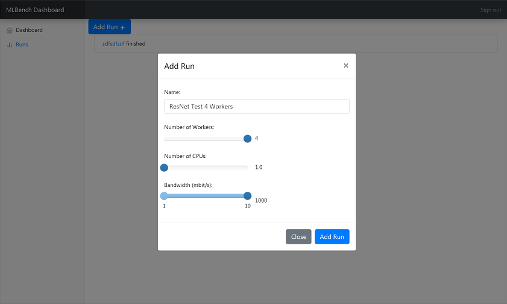

=========
Dashboard
=========

MLBench comes with a dashboard to manage and monitor the cluster and jobs.

Main Page
---------

   Dashboard Main Page

The main view shows all MLBench worker nodes and their current status

Test Page
---------

   Dashboard Test Page

The Test page allows you to start an OpenMPI job on the worker nodes and shows the result