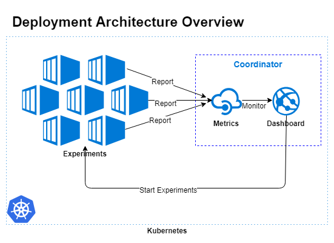

========
Overview
========

   Deployment Overview: Relation between Worker and Master

mlbench consists of two components, the **Master** and the **Worker** Docker containers.

Master
-----------
The master contains the Dashboard, the  main interface for the project. The dashboard allows
you to start and run a distributed ML experiment and visualizes the progress and result of the
experiment. It allows management of the mlbench nodes in the kubernetes cluster and for most
users constitutes the sole way they interact with the mlbench project.

It also contains a decidated metrics API that is used for the nodes to report their state back
to the Master.

The Master can also be granted access to the Kubernetes API to manage cluster settings
relevant to the workers.

Worker
----------
The worker image contains all the boilerplate code needed for a distributed ML model and
as well as the actual model code. It takes care of training the distributed model, depending
on the settings provided by the Master. So the Master informs the Worker nodes
what experiment the user would like to run and they run the relevant code by themselves.

Worker nodes send status information to the metrics API of the Master to inform it
of the progress and state of the current run.